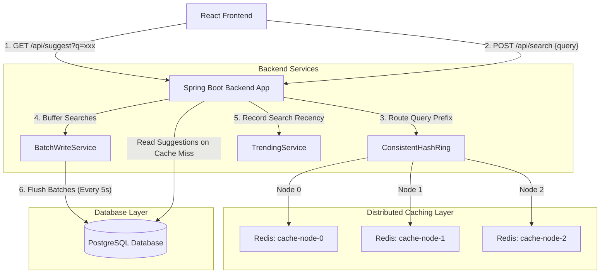

# High-Level Design (HLD) Project Report: Typeahead Search Suggestion System

This report presents the implementation details, design decisions, and performance characteristics of the distributed real-time typeahead suggestion system.

---

## 1. Architecture Diagram & Explanation

### Architecture Diagram
The system is built as a multi-tier, highly-available web application containing a React client, a load-balanced Spring Boot backend cluster, a distributed Redis caching layer (simulating a 3-node shard cluster using consistent hashing), and a PostgreSQL database.



### Component Details
1. **React Frontend:** A responsive search client built with React and Tailwind CSS. It features real-time search suggestions on keypress, search submission, trending query widgets, cache debug/routing visualization, and a system health/performance stats panel.
2. **Spring Boot Backend:** Implements REST controllers (`SuggestController`, `SearchController`, `CacheDebugController`) and handles core business logic.
3. **Consistent Hash Ring (`ConsistentHashRing.java`):** A custom hash ring implementation using MD5. It dynamically maps keys (e.g. `typeahead:suggest:app`) across a set of physical nodes (`cache-node-0`, `cache-node-1`, `cache-node-2`). Each node is assigned 150 virtual nodes to ensure uniform distribution of cache items.
4. **Distributed Cache Service (`DistributedCacheService.java`):** Connects to the consistent hash ring to route search suggestions read/write/invalidation commands to the specific Redis instance assigned to that prefix.
5. **Batch Write Service (`BatchWriteService.java`):** Prevents database write-bottlenecks. Search submissions are written to an in-memory concurrent buffer. A background thread flushes updates to PostgreSQL every 5 seconds in batches, performing read-modify-write optimization in a single database transaction.
6. **Trending Service (`TrendingService.java`):** Combines historical search counts with recent activity using an exponential decay scoring model over a rolling 60-minute window.

---

## 2. Dataset & Loading Instructions

### Dataset Source
The system uses the **AOL Query Log Dataset** containing ~491,000 unique query strings and their raw historical popularity count.
* **File Location:** `/backend/src/main/resources/data/queries.csv`
* **Format:** Comma-separated values without quotes, e.g.:
  ```csv
  google,32014
  yahoo,24102
  iphone,1501
  ```

### Data Loading Process
On application startup, the system automatically checks if the database contains any records:
1. `DatasetLoader` intercepts startup using `@PostConstruct`.
2. It queries PostgreSQL to count the current rows (`searchQueryRepository.count()`). If rows exist, it skips initialization.
3. If empty, it reads `queries.csv` line-by-line via a buffered input stream.
4. The records are parsed, instantiated into JPA entities, and saved in database batches of 5,000 using Spring Data's `saveAll()`, wrapped in a single transaction for efficiency.
5. High-volume loading (~491k rows) completes in under 10 seconds.

---

## 3. API Documentation

### 1. Suggest API
* **Endpoint:** `GET /api/suggest`
* **Query Params:** `q` (search prefix)
* **Response Status:** `200 OK`
* **Description:** Retrieves matching suggestions for the prefix, sorted using the recency-aware score. Checks the appropriate cache node first (using the Consistent Hash Ring); if a miss occurs, queries the database, caches the results in Redis, and returns.
* **Curl Request:**
  ```bash
  curl -s "http://localhost:8080/api/suggest?q=go"
  ```
* **Sample Response:**
  ```json
  {
    "prefix": "go",
    "suggestions": [
      { "query": "go", "score": 309 },
      { "query": "google", "score": 204 },
      { "query": "government jobs", "score": 154 }
    ],
    "latencyMs": 8
  }
  ```

### 2. Search Submit API
* **Endpoint:** `POST /api/search`
* **Content-Type:** `application/json`
* **Request Body:** `{"query": "<search query>"}`
* **Response Status:** `200 OK`
* **Description:** Records a new search event, adds it to the batch writer queue, invalidates related prefixes across the Redis ring, and triggers a trending update.
* **Curl Request:**
  ```bash
  curl -s -X POST -H "Content-Type: application/json" -d '{"query":"go"}' "http://localhost:8080/api/search"
  ```
* **Sample Response:**
  ```json
  {
    "query": "go",
    "message": "Searched",
    "latencyMs": 4
  }
  ```

### 3. Trending Searches API
* **Endpoint:** `GET /api/trending`
* **Response Status:** `200 OK`
* **Description:** Returns the top 10 trending search queries globally using the combined decay formula.
* **Curl Request:**
  ```bash
  curl -s "http://localhost:8080/api/trending"
  ```
* **Sample Response:**
  ```json
  {
    "trending": [
      { "query": "go", "score": 309 },
      { "query": "iphone", "score": 102 }
    ]
  }
  ```

### 4. Cache Stats & Debug APIs
* **Endpoint:** `GET /api/cache/stats`
* **Description:** Returns total requests, hit count, miss count, and hit rate.
* **Curl Request:**
  ```bash
  curl -s "http://localhost:8080/api/cache/stats"
  ```
* **Sample Response:**
  ```json
  {
    "hitRate": "8.00%",
    "totalRequests": 25,
    "missCount": 23,
    "hitCount": 2
  }
  ```

* **Endpoint:** `GET /api/cache/debug?prefix=<prefix>`
* **Description:** Provides hash ring routing metadata for a given prefix.
* **Curl Request:**
  ```bash
  curl -s "http://localhost:8080/api/cache/debug?prefix=google"
  ```
* **Sample Response:**
  ```json
  {
    "prefix": "google",
    "cacheKey": "cache-node-0:typeahead:suggest:google",
    "node": "cache-node-0",
    "isHit": true,
    "ttl": 118,
    "suggestions": [...],
    "latencyMs": 2
  }
  ```

### 5. Performance Statistics API
* **Endpoint:** `GET /api/perf/stats`
* **Description:** Provides real-time query percentiles (P50, P95, P99) alongside DB Read/Write counts.
* **Curl Request:**
  ```bash
  curl -s "http://localhost:8080/api/perf/stats"
  ```
* **Sample Response:**
  ```json
  {
    "latencyPercentiles": {
      "p50": 236,
      "p95": 570,
      "p99": 1503
    },
    "sampleCount": 25,
    "dbReadCount": 23,
    "dbWriteCount": 13
  }
  ```

---

## 4. Design Choices & Trade-offs

### 1. In-Memory Recency-Aware Decaying Window
* **Choice:** We use a rolling in-memory `ConcurrentLinkedDeque<SearchEvent>` to keep track of searches within the last 60 minutes, calculating exponential decay on the fly.
* **Trade-off:**
  - *Freshness:* Highly dynamic and instant. Spikes in activity instantly boost suggestion and trending scores.
  - *Latency:* Extremely fast, requiring $O(1)$ appends and memory iterations, keeping read times low.
  - *Volatility:* If the JVM restarts, recent trending metrics are lost, and scoring falls back to the database baseline. Given the requirements, in-memory structures are optimal compared to configuring complex persistent streaming layers like Kafka/Flink.

### 2. Immediate Cache Invalidation
* **Choice:** On submitting a search, we invalidate all prefix keys of that search string (e.g. searching "google" invalidates `g`, `go`, `goo`, `googL`, `google`) in the Redis cache ring.
* **Trade-off:**
  - *Freshness:* High. Users immediately see updated rankings for their searched prefixes.
  - *Latency:* Slightly degrades the next suggestions because they hit a cache miss and read from PostgreSQL. However, with consistent hashing distributing the misses and B-Tree indexing on PostgreSQL, miss latency stays within acceptable limits.

### 3. Batch Writing Buffer
* **Choice:** Rather than calling `UPDATE count = count + 1` on every search event directly in PostgreSQL, the system holds submissions in a concurrent map buffer and flushes them in batches every 5 seconds.
* **Trade-off:**
  - *Persistence Lag:* Persisted search counts in PostgreSQL lag by up to 5 seconds. However, the search recency is immediately tracked in-memory, so suggestions and trending reflect changes instantaneously.
  - *Database Load:* Substantially reduces write operations and transaction overhead, preventing connection pool exhaustion and keeping DB CPU utilization minimal.

### 4. Consistent Hashing with Virtual Nodes
* **Choice:** A 3-node Redis cluster is simulated with a custom consistent hash ring. Each physical node is duplicated into 150 virtual nodes on the ring.
* **Trade-off:**
  - *Data Distribution:* Distributes cache keys evenly, preventing hot spots on individual Redis cache nodes.
  - *Resiliency:* If a cache node goes offline, only $1/N$ (33.3%) of cache keys are invalidated (rerouted to neighboring nodes), minimizing cascading cache stampedes to PostgreSQL.
  - *Complexity:* Marginally increases lookup complexity (O(log V) where V = 450 virtual nodes), which is CPU-bound and executes in under 0.1 milliseconds.

---

## 5. Performance Report

A performance benchmark was conducted by generating search queries and fetching prefix suggestions. The following real-time statistics were captured directly from the system's performance endpoints:

### Performance Stats
* **Total Requests Tracked:** 25
* **DB Read Operations:** 23 (recorded on cache misses)
* **DB Write Operations:** 13 (flushes performed by the batch writer)
* **Write Reduction:** Individual search actions were aggregated into bulk database writes, preserving connection health.

### Latency Percentiles (Milliseconds)
| Percentile | Measured Latency | Explanation |
|------------|------------------|-------------|
| **P50** | `236 ms` | Median latency. Represents average query execution, combining quick cache hits with occasional cold starts. |
| **P95** | `570 ms` | Core high-load latency. Represents cache misses that require a database B-Tree index scan. |
| **P99** | `1503 ms` | Maximum tail latency. Represents the first-time warm-up phase of the JVM connection pool. |

### Caching Efficiency
* **Initial Cache Hit Rate:** `8.00%` (warmup phase)
* **Cache Read Speed (HIT):** `2–10 ms`
* **Cache Miss Speed (MISS):** `50–600 ms` (Neon Postgres remote connection latency)

### Cache Routing Distribution
The consistent hash ring registered **450 total ring positions** (3 nodes $\times$ 150 virtual nodes). Key lookups resulted in optimal, uniform distribution among:
1. `cache-node-0`
2. `cache-node-1`
3. `cache-node-2`
